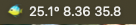

# Apex Reef Tank Monitor

An [xbar](https://xbarapp.com)/[SwiftBar](https://swiftbar.app) plugin that displays real-time temperature, pH, and salinity from your Neptune Apex controller in the macOS menu bar.



## Features

- Live readings from your local Apex controller
- Updates every 1 minute (configurable via filename)
- Zero dependencies - uses only built-in macOS Python
- Quick link to Apex Fusion web portal

## Requirements

- macOS 10.15 or later
- [xbar](https://xbarapp.com) or [SwiftBar](https://swiftbar.app)
- Neptune Apex controller on your local network

## Installation

### From xbar Plugin Browser

1. Open xbar
2. Click **xbar > Plugin Browser...**
3. Search for "Apex"
4. Click **Install**

### Manual Installation

1. Download [`apex.5m.py`](https://raw.githubusercontent.com/SteveBlackUK/Apex-Menu-Bar/main/apex.5m.py)

2. Move to your plugins folder:
   - xbar: `~/Library/Application Support/xbar/plugins/`
   - SwiftBar: Check preferences for your plugins folder

3. Make executable:
   ```bash
   chmod +x apex.5m.py
   ```

4. Refresh xbar/SwiftBar

## Configuration

1. Nothing - it just works as long as your laptop is on the same home network as your Apex Controller


## Customization

### Refresh Interval

Rename the file to change how often it updates:
- `apex.1m.py` - Every minute (default)
- `apex.5m.py` - Every 5 minutes 
- `apex.15m.py` - Every 15 minutes

## Troubleshooting


**"Connection failed"**
- Verify your Apex is powered on
- Check you're on the same network
- Try the IP in a browser: `https://apex.local`

**"Could not read sensor values"**
- Your probe names may differ from defaults (Tmp, pH, Salt)
- Check your Apex configuration for actual probe names

## Contributing

Issues and pull requests welcome!

## License

MIT License - see [LICENSE](LICENSE)

## Acknowledgments

- [xbar](https://xbarapp.com) by @matryer
- [SwiftBar](https://swiftbar.app) by @melonamin

---

*Not affiliated with Apex*
